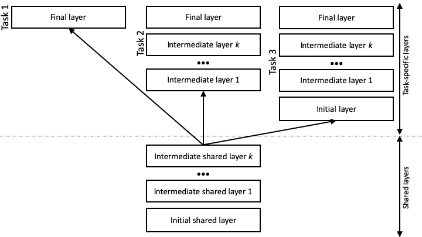

## Multi-task Learning

One core feature of `Metal` is the ability to jointly train multiple tasks at the same time, with some layers in the architecture being shared between tasks, and some specific to each task. The figure below shows some common scenarios:



The shared layers are defined under `mtl.layers`. They are not mandatory, but, if they exist, the shared layers must contain an initial layer. and must _not_ contain a final layer, as these are task specific. Task 1 in the figure shows the most common scenario in `Metal`, where a task relies on the shared layers to generate a representation of the text, and only includes a final layer, which contains the feed forward network to produce the task-specific labels. In general, all the layers that are specific to `task`_i_ are defined under `mtl.task`_i_`.layers`. `Metal` supports other configurations, as exemplified in the figure for tasks 2 and 3. For example, task 2 includes additional intermediate layers that are not shared with the other tasks. Task 3 also includes an initial layer. In the latter scenario, where a task includes a task-specific initial layer, no information produces by the shared layers is used. The task encodes the text from scratch using its own initial layer and following intermediate ones. 

As a concrete example, we observed that part-of-speech (POS) tagging, syntactic chunking, and the identification of semantic role labeling (SRL) predicates train well in a multi-task learning (MTL) setting. The data for all these tasks is formatted as a basic `Metal` task. Below are a few examples from these datasets.

POS tagging:
```
Pierre  NNP
Vinken  NNP
,       ,
61      CD
years   NNS
old     JJ
,       ,
will    MD
join    VB
... 
```

Syntactic chunking:
```
Confidence      B-NP
in      B-PP
the     B-NP
pound   I-NP
is      B-VP
widely  I-VP
expected        I-VP
to      I-VP
take    I-VP
...
```

SRL predicates (using the Simple Extended format - see the File Formats section for details):
```
Ms.     NNP     B-PER   O
Haag    NNP     I-PER   O
plays   VBZ     O       B-P
Elianti NNP     B-ORG   O
.       .       O       O
...
```

The [configuration file](https://github.com/clulab/processors/blob/master/main/src/main/resources/org/clulab/mtl-en-pos-chunk-srlp.conf) to jointly train these three tasks is the following:

```yml
mtl {
  shardsPerEpoch = 10
  maxEpochs = 50
  epochPatience = 5
  numberOfTasks = 3

  layers {
    initial {
      learnedWordEmbeddingSize = 128
      charEmbeddingSize = 32
      charRnnStateSize = 16
      c2i = "org/clulab/c2i-en.txt"
    }

    intermediate1 {
      rnnStateSize = 128
      useHighwayConnections = false
      numLayers = 1
    }
  }

  task1 {
    name = "En POS tagging"
    train = "dynet/en/pos/train.txt"
    dev = "dynet/en/pos/dev.txt"
    test = "dynet/en/pos/test.txt"

    layers {
      final {
        inference = "greedy"
      }
    }
  }

  task2 {
    name = "En chunking"
    train = "dynet/en/chunking/train.txt"
    dev = "dynet/en/chunking/test.txt"
    test = "dynet/en/chunking/test.txt"

    layers {
      final {
        inference = "viterbi"
      }
    }
  }

  task3 {
    name = "En SRL predicates"
    train = "dynet/en/srl/train.preds"
    dev = "dynet/en/srl/dev.preds"
    test = "dynet/en/srl/test-wsj.preds"

    layers {
      final {
        inference = "greedy"
      }
    }
  }
}
```

Note that all three tasks follow the setting used for task 1 in the figure. As shown in the configuration file, the final layers are task-specific. For example, we observed that chunking benefits from the CRF layer ("viterbi"), whereas the other two tasks do not. 


